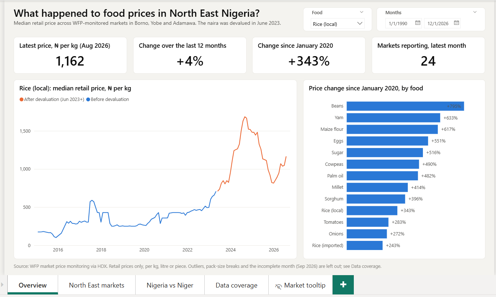
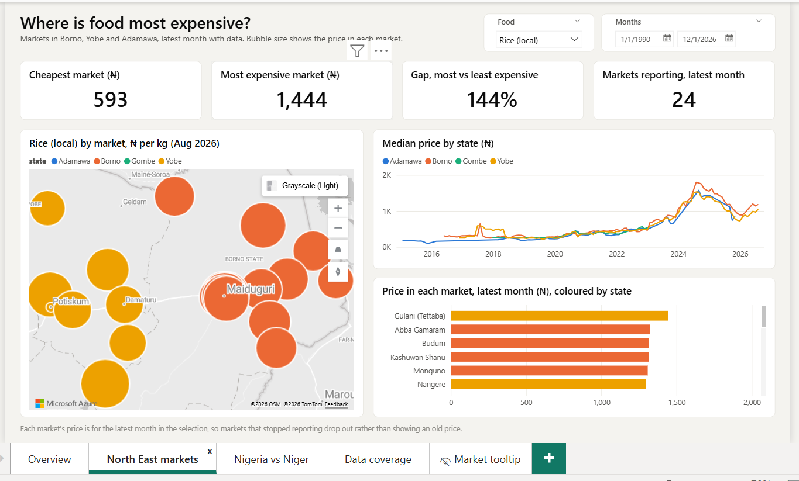
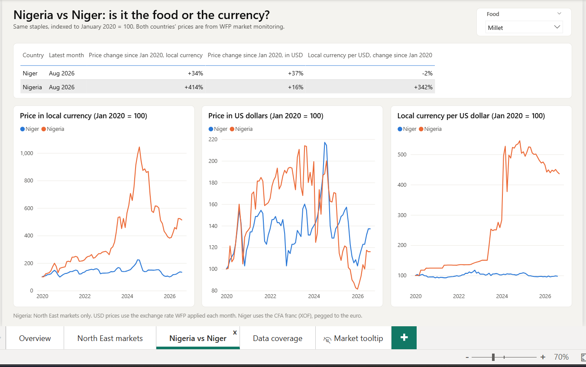
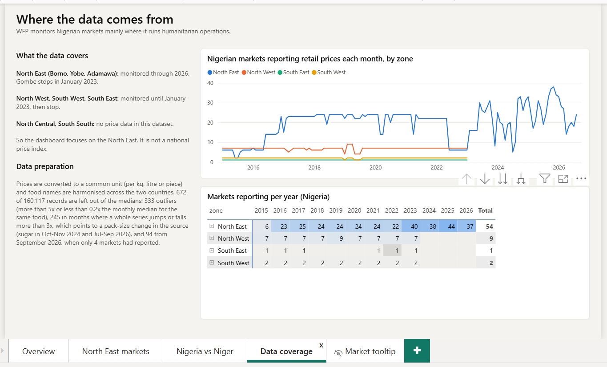

# Food Price Explorer: North East Nigeria and Niger

An interactive Power BI dashboard on staple food prices in North East Nigeria (Borno, Yobe and Adamawa), with a comparison against neighbouring Niger. It uses World Food Programme (WFP) market price data, 2015 to August 2026.

The question behind it: food prices in Nigeria have risen sharply since the naira was devalued in June 2023. How much of that is food getting more expensive, and how much is the currency losing value?



## What the dashboard shows

| Page | What it answers |
|---|---|
| **Overview** | What happened to food prices in North East Nigeria? Latest price, change over 12 months and since January 2020, a price trend with the June 2023 devaluation marked, and a ranking of 14 staples by price change since 2020. |
| **North East markets** | Where is food most expensive? A map of markets (bubble size = price), a state by state comparison, and the price in every market for the latest month. Hovering over a market shows its own price trend. |
| **Nigeria vs Niger** | Is it the food or the currency? The same staples indexed to January 2020 = 100, in local currency, in US dollars, and the exchange rate itself. |
| **Data coverage** | Which zones and states have data, and for which years, plus how the data was prepared. |

Every page has a food selector; the first two also have a date range.





## What the data says (August 2026)

- **Local rice** in North East markets costs a median of ₦1,162 per kg, about 4% more than a year earlier and 343% more than in January 2020.
- **Millet** in North East Nigeria is up 414% since January 2020 in naira, but only 16% in US dollars. Over the same period the naira went from about 306 to about 1,351 per dollar (+342%). Most of the rise in naira prices tracks the fall of the currency.
- **Niger**, whose CFA franc is pegged to the euro, saw millet rise 34% in local currency over the same period.
- Prices peaked in late 2024 and fell back through 2025 before rising again in 2026.

These are descriptive patterns in market prices, not a full explanation: conflict, harvests, fuel and transport costs also move prices in the North East.

## Data

**Source:** [WFP Nigeria - Food Prices](https://data.humdata.org/dataset/wfp-food-prices-for-nigeria) and [WFP Niger - Food Prices](https://data.humdata.org/dataset/wfp-food-prices-for-niger) on the Humanitarian Data Exchange (HDX), downloaded October 2026. See the HDX pages for the licence and methodology.

160,117 price records from 147 markets and 44 foods, kept in `data/raw/` exactly as downloaded.

### Coverage: why the focus is the North East

WFP collects prices where it runs humanitarian operations, so this is **not a national price index**:

| Zone | Coverage in this dataset |
|---|---|
| North East (Borno, Yobe, Adamawa) | Monitored through August 2026. Gombe stops in January 2023. |
| North West, South West, South East | Monitored until January 2023, then stop. |
| North Central, South South | No price data. |

The Nigeria figures on every page use North East markets only, so the comparison over time is like for like.



### Preparation (`scripts/clean.py`)

- **Common units.** Prices come in many pack sizes (2.7 kg of rice, 500 g of sugar, 100 tubers of yam). Each is converted to a price per kg, litre or piece, and a food is only compared in its most common unit.
- **Harmonised names.** Food names differ between the two countries (for example "Beans (niebe)" in Niger is cowpeas), so they are grouped into common foods.
- **Retail prices only**, using the median across markets so a few unusual markets don't pull the figure.
- **Nothing is deleted.** 672 records (0.4%) are flagged in an `exclude` column with the reason, and left out of the medians:
  - 333 **outliers**: more than 5x or less than 0.2x the median for the same food in the same month.
  - 245 **unit breaks**: months where a whole series jumps or falls more than 3x against the months before and after it. The clearest case is sugar, labelled "500 G" throughout, whose price jumps 5x in October to November 2024 and again from July 2026, which points to a change in pack size in the source rather than a real price move. Without this check, sugar showed a 2,356% rise since 2020.
  - 94 records from **September 2026**, when only 4 markets had reported against about 24 in a normal month.
- **Exchange rates** are implied from WFP's own records (local price divided by USD price), saved in `data/clean/fx_monthly.csv`.

## How it's built

```
data/raw/            WFP CSVs from HDX, unchanged
data/clean/          cleaned tables loaded by Power BI
scripts/clean.py     cleaning and data quality flags
scripts/make_tmdl.py first version of the data model (used once to set it up)
scripts/add_measures.py  extra DAX measures used by the report
scripts/make_report.py   generates the report pages and theme
powerbi/             Power BI project (.pbip): report and semantic model as text files
```

- **Model:** a star schema with `prices` as the fact table and markets, commodities, dates and countries as dimensions, plus a monthly exchange rate table. Around 30 DAX measures (median price, latest month, 12 month and since 2020 change, price index, market spread, exchange rate index).
- **Report:** saved as a Power BI project, so pages, measures and the theme are plain text and can be reviewed in Git. The pages are generated from `scripts/make_report.py`.
- **Theme:** a custom theme with a colour-blind-checked categorical palette.

## Running it yourself

1. Install [Power BI Desktop](https://powerbi.microsoft.com/desktop/) (Windows).
2. Optional: re-run the cleaning with Python 3 and pandas: `python scripts/clean.py`
3. Open `powerbi/food-price-explorer.pbip`.
4. Point the model at your copy of the data: **Transform data > Edit parameters > DataFolder**, set it to the full path of `data/clean/` (ending in `\`), then **Refresh**.
5. The market map uses Azure Maps, which needs you to be signed in to Power BI Desktop.

## Tools

Python (pandas) for cleaning, Power BI Desktop (DAX, Power Query, TMDL) for the model and report.


## License

Code: MIT License. Data: WFP price data is © World Food Programme, used under CC BY-IGO (check the HDX pages for current terms). The MIT license does not apply to the data.
